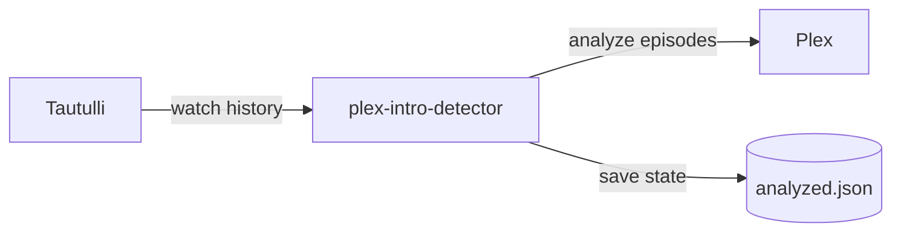

# Plex Intro Detector

[](https://hub.docker.com/r/jangerhard/plex-intro-detector)
[](https://claude.ai)
[](LICENSE)

> **Disclaimer:** This project was generated with AI assistance (Claude). Review the code before deploying to your environment.

Selectively trigger Plex intro detection based on what users actually watch, instead of scanning your entire library.

## Why This Exists

Plex's built-in intro detection is **CPU-intensive** and runs on all content. If you:

- Share your server with users who don't care about "Skip Intro"
- Have a large library but only watch a fraction of it
- Want to save CPU cycles on your server

This tool solves that by only analyzing shows that specific users watch.

## Who Is This For

**Plex Pass holders who share their server with non-Plex Pass users.**

Plex Pass is required to display "Skip Intro" and "Skip Credits" buttons. If you're the only Plex Pass holder on your server, why waste CPU cycles scanning shows that only your non-Plex Pass users watch? They can't use the feature anyway.

This tool lets you selectively scan only the shows *you* watch, saving server resources while still getting "Skip Intro" where it matters.

## Prerequisites

- **Plex Media Server** with a valid token
- **Tautulli** monitoring your Plex server (for watch history)
- **Docker** and Docker Compose

## Quick Start

### Option A: Docker Hub (recommended)

```bash
docker run -d \
  --name plex-intro-detector \
  -e PLEX_URL=http://your-plex:32400 \
  -e PLEX_TOKEN=your-plex-token \
  -e TAUTULLI_URL=http://your-tautulli:8181 \
  -e TAUTULLI_API_KEY=your-api-key \
  -e TARGET_USERS=alice,bob \
  -e RUN_INTERVAL=6h \
  -v ./config:/config \
  jangerhard/plex-intro-detector
```

### Option B: Docker Compose

1. Create a `docker-compose.yml`:

```yaml
services:
  plex-intro-detector:
    image: jangerhard/plex-intro-detector
    container_name: plex-intro-detector
    environment:
      - PLEX_URL=http://your-plex:32400
      - PLEX_TOKEN=your-plex-token
      - TAUTULLI_URL=http://your-tautulli:8181
      - TAUTULLI_API_KEY=your-api-key
      - TARGET_USERS=alice,bob
      - RUN_INTERVAL=6h
    volumes:
      - ./config:/config
    restart: unless-stopped
```

2. Run it:

```bash
docker compose up -d
```

### Option C: Build from source

```bash
git clone https://github.com/jangerhard/plex-intro-detector.git
cd plex-intro-detector
cp .env.example .env
# Edit .env with your credentials
docker compose up --build -d
```

### Test with dry run first

Add `-e DRY_RUN=true` to see what would be analyzed without actually triggering Plex:

```
Found 5 shows watched by target users (42 episodes)
[DRY RUN] Would analyze: Show Name - Episode Title
Complete: 1 shows, 10 analyzed, 0 skipped...
```

## How It Works



1. Queries Tautulli for shows watched by target users
2. Gets **all episodes** from those shows (not just watched ones)
3. Skips episodes that already have markers or were processed
4. Triggers Plex's `analyze()` on remaining episodes
5. Saves state to avoid re-processing

## Smart Skip Logic

Episodes are skipped when:

- **Has intro marker** - Already has "Skip Intro"
- **Has credits marker** - Already scanned, no intro found
- **Already watched by target users** - No need for "Skip Intro" on seen content
- **In state file** - Previously processed

## Configuration Reference

### Required

- **`PLEX_URL`** - Plex server URL (e.g., `http://plex:32400`)
- **`PLEX_TOKEN`** - Your Plex X-Plex-Token ([how to find](https://support.plex.tv/articles/204059436-finding-an-authentication-token-x-plex-token/))
- **`TAUTULLI_URL`** - Tautulli URL (e.g., `http://tautulli:8181`)
- **`TAUTULLI_API_KEY`** - Tautulli API key (Settings → Web Interface)
- **`TARGET_USERS`** - Comma-separated Plex usernames

### Optional

- **`LOOKBACK_DAYS`** (default: `7`) - Days of watch history to check
- **`DRY_RUN`** (default: `false`) - Log actions without executing
- **`MAX_ANALYZE`** (default: `20`) - Max episodes to analyze per run
- **`RUN_INTERVAL`** (default: unset) - Schedule interval (`6h`, `30m`, `1d`). If unset, runs once and exits
- **`SKIP_WATCHED`** (default: `true`) - Skip episodes already watched by target users
- **`STATE_FILE`** (default: `/config/analyzed.json`) - Path to state file

## Initial Backlog Processing

For a new setup with existing watch history:

1. Set `LOOKBACK_DAYS=90` to catch all recently watched shows
2. Set `MAX_ANALYZE=50` to process larger batches
3. Run every 1-2 hours until caught up
4. Then reduce to `LOOKBACK_DAYS=7` for ongoing use

## Post-Deployment (Optional)

To save resources, disable Plex's global intro detection:

1. Plex → Settings → Library
2. Disable "Detect intros and credits"

This tool will handle intro detection for shows your users actually watch.

## Troubleshooting

- **"Show not found" warnings** - Show may have been removed from Plex
- **Container can't reach Plex/Tautulli** - Use IP addresses, not `localhost`. On macOS, use `host.docker.internal`
- **No episodes found** - Check `TARGET_USERS` matches Tautulli usernames exactly
- **All episodes skipped** - Normal if already processed. Delete `config/analyzed.json` to reprocess

## License

MIT
