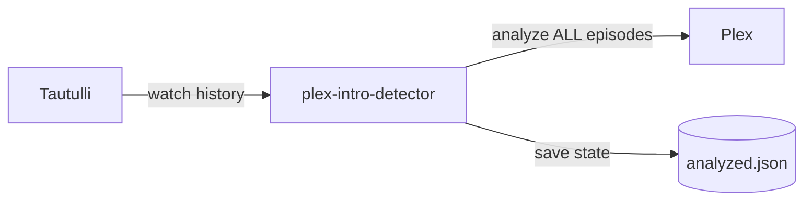

# Plex Intro Detector

[](https://hub.docker.com/r/jangerhard/plex-intro-detector)
[](https://claude.ai)
[](LICENSE)

> **Disclaimer:** This project was generated with AI assistance (Claude). Review the code before deploying to your environment.

**Proactively trigger Plex intro detection for shows you watch, so "Skip Intro" is ready before you need it.**

## Why?

Plex's built-in intro detection has two problems:

1. **It runs on everything** - Your server spends hours analyzing shows nobody watches
2. **It only runs during library scans** - New episodes often lack intro markers when you first watch them

This tool flips the approach: instead of scanning your entire library, it watches what *you* watch and proactively analyzes those shows.

### The Key Difference

**This tool analyzes ALL episodes of a show, not just the one you watched.**

When you watch Episode 1 of a new series, plex-intro-detector triggers analysis on the entire show. By the time you get to Episode 2, "Skip Intro" is already waiting.

### Example Scenario

| Without this tool | With this tool |
|-------------------|----------------|
| Watch Episode 1 of new show | Watch Episode 1 of new show |
| No "Skip Intro" (not scanned yet) | Tool detects you started a new show |
| Manually trigger library scan... | Analyzes all 20 episodes in background |
| Wait for scan to complete... | Episode 2 has "Skip Intro" ready |
| Finally get "Skip Intro" | All future episodes ready to go |

## Requirements

- **Plex Media Server** with Plex Pass
- **[Tautulli](https://tautulli.com/)** for watch history tracking
- **Docker**

### Plex Pass Note

"Skip Intro" requires Plex Pass for the viewing user:

- **Managed Users (Plex Home)** - Inherit the server owner's Plex Pass ✓
- **External users** - Need their own Plex Pass subscription

Without Plex Pass, intro markers exist but the skip button won't appear. This tool is most useful for server owners who want "Skip Intro" for themselves without scanning content only their non-Plex Pass users watch.

## How It Works



1. Queries Tautulli for shows watched by target users
2. Gets **all episodes** from those shows (not just watched ones)
3. Skips episodes that already have markers or were processed
4. Triggers Plex's `analyze()` on remaining episodes
5. Saves state to avoid re-processing

### Smart Skip Logic

Episodes are skipped when:

- **Has intro marker** - Already has "Skip Intro"
- **Has credits marker** - Already scanned, no intro found
- **Already watched by target users** - No need for "Skip Intro" on seen content
- **In state file** - Previously processed

## Installation

### Option A: Docker Run

```bash
docker run -d \
  --name plex-intro-detector \
  -e PLEX_URL=http://your-plex:32400 \
  -e PLEX_TOKEN=your-plex-token \
  -e TAUTULLI_URL=http://your-tautulli:8181 \
  -e TAUTULLI_API_KEY=your-api-key \
  -e TARGET_USERS=alice,bob \
  -e RUN_INTERVAL=6h \
  -v ./config:/config \
  jangerhard/plex-intro-detector
```

### Option B: Docker Compose

```yaml
services:
  plex-intro-detector:
    image: jangerhard/plex-intro-detector
    container_name: plex-intro-detector
    environment:
      - PLEX_URL=http://your-plex:32400
      - PLEX_TOKEN=your-plex-token
      - TAUTULLI_URL=http://your-tautulli:8181
      - TAUTULLI_API_KEY=your-api-key
      - TARGET_USERS=alice,bob
      - RUN_INTERVAL=6h
    volumes:
      - ./config:/config
    restart: unless-stopped
```

```bash
docker compose up -d
```

### Test with Dry Run

Add `-e DRY_RUN=true` to see what would be analyzed without triggering Plex:

```
Found 5 shows watched by target users (42 episodes)
[DRY RUN] Would analyze: Show Name - Episode Title
Complete: 1 shows, 10 analyzed, 0 skipped...
```

## Configuration

### Required

| Variable | Description |
|----------|-------------|
| `PLEX_URL` | Plex server URL (e.g., `http://plex:32400`) |
| `PLEX_TOKEN` | Your Plex X-Plex-Token ([how to find](https://support.plex.tv/articles/204059436-finding-an-authentication-token-x-plex-token/)) |
| `TAUTULLI_URL` | Tautulli URL (e.g., `http://tautulli:8181`) |
| `TAUTULLI_API_KEY` | Tautulli API key (Settings → Web Interface) |
| `TARGET_USERS` | Comma-separated Plex usernames to monitor |

### Optional

| Variable | Default | Description |
|----------|---------|-------------|
| `LOOKBACK_DAYS` | `7` | Days of watch history to check |
| `DRY_RUN` | `false` | Log actions without executing |
| `MAX_ANALYZE` | `20` | Max episodes to analyze per run |
| `RUN_INTERVAL` | unset | Schedule interval (`6h`, `30m`, `1d`). If unset, runs once and exits |
| `SKIP_WATCHED` | `true` | Skip episodes already watched by target users |
| `STATE_FILE` | `/config/analyzed.json` | Path to state file |

## Initial Setup

For a new setup with existing watch history:

1. Set `LOOKBACK_DAYS=90` to catch all recently watched shows
2. Set `MAX_ANALYZE=50` to process larger batches
3. Run every 1-2 hours until caught up
4. Then reduce to `LOOKBACK_DAYS=7` for ongoing use

## Disabling Plex's Global Detection (Optional)

Once running, you can disable Plex's resource-heavy global scanning:

1. Plex → Settings → Library
2. Disable "Detect intros and credits"

This tool will handle intro detection for shows you actually watch.

## Troubleshooting

- **"Show not found" warnings** - Show may have been removed from Plex
- **Container can't reach Plex/Tautulli** - If all services are in the same Docker Compose stack, use container names (e.g., `http://plex:32400`). Otherwise, use LAN IP addresses. On macOS Docker Desktop, use `host.docker.internal`
- **No episodes found** - Check `TARGET_USERS` matches Tautulli usernames exactly (case-insensitive)
- **All episodes skipped** - Normal if already processed. Delete `config/analyzed.json` to reprocess

## License

[MIT](LICENSE)
